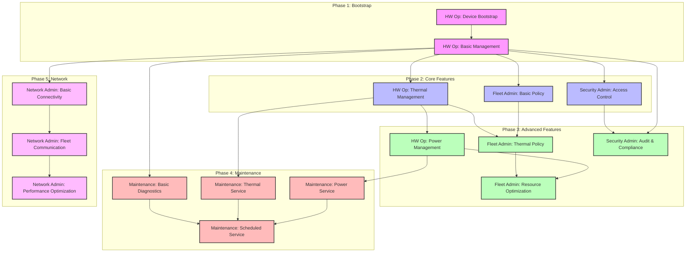

# Journey Dependencies

⚠️ **IMPORTANT**: This diagram must only be updated by human operators alongside the README.md.

This diagram shows the dependencies between different user journeys that must be validated for v1.0.

## Node Key
- Bootstrap (Pink): Initial setup and basic functionality
- Core (Blue): Essential features required by other components
- Advanced (Green): Enhanced features building on core functionality
- Maintenance (Red): Service and maintenance capabilities
- Network (Purple): Connectivity and communication features

## Reading the Diagram
- Arrows indicate dependencies (must validate source before target)
- Grouped boxes show related phases
- Each node represents a complete journey that must be validated
- Colors indicate feature category and general complexity

## Validating Journeys
1. Start from Device Bootstrap (A)
2. Follow arrows to next possible journeys
3. All incoming dependencies must be validated before starting a journey
4. Mark journey as complete in README.md after validation