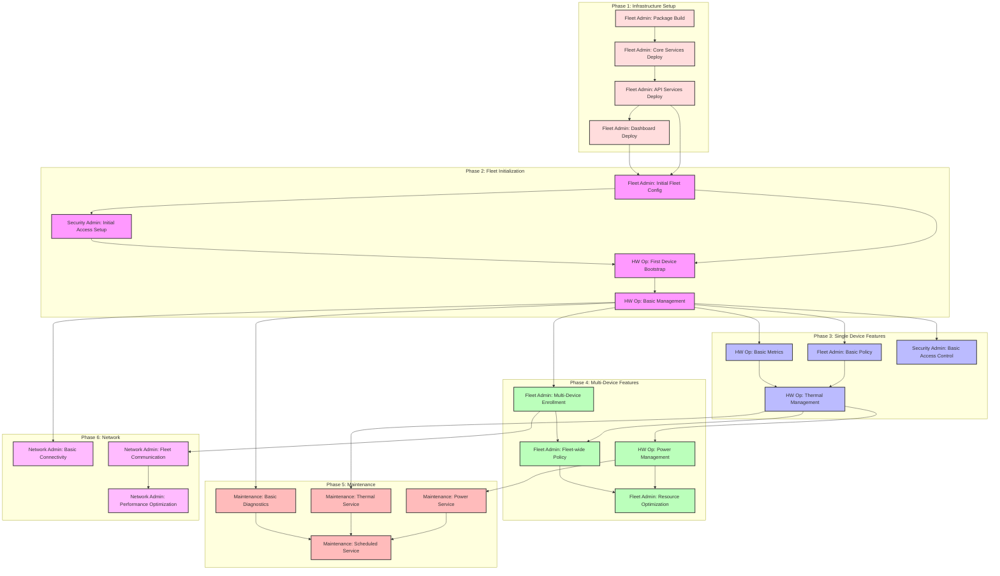

# Journey Dependencies

⚠️ **IMPORTANT**: This diagram must only be updated by human operators alongside the README.md.

This diagram shows the dependencies between different user journeys that must be validated for v1.0, starting with fundamental infrastructure requirements.

## Node Key
- Infrastructure (Red): Foundational services and deployments
- Fleet Init (Pink): Initial fleet and device setup
- Single Device (Blue): Features validated with one device
- Multi Device (Green): Features requiring multiple devices
- Maintenance (Red): Service and maintenance capabilities
- Network (Purple): Connectivity and communication features

## Reading the Diagram
- Arrows indicate strict dependencies (must validate source before target)
- Grouped boxes show related phases
- Each node represents a complete journey that must be validated
- Colors indicate feature category and general progression

## Validation Process
1. Start with Package Build (A)
2. Follow arrows to next possible journeys
3. All incoming dependencies must be validated before starting a journey
4. Cannot skip phases - infrastructure and initialization are required
5. Mark journeys as complete in README.md after validation

## Integration Points
- Phase 1 validates core infrastructure
- Phase 2 enables first device connection
- Phase 3 establishes basic functionality
- Phase 4 scales to multiple devices
- Phase 5 adds maintenance capabilities
- Phase 6 optimizes communication