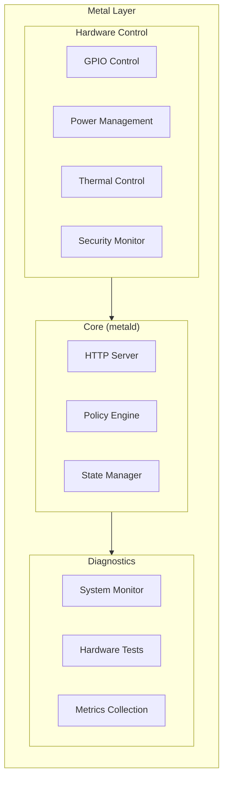
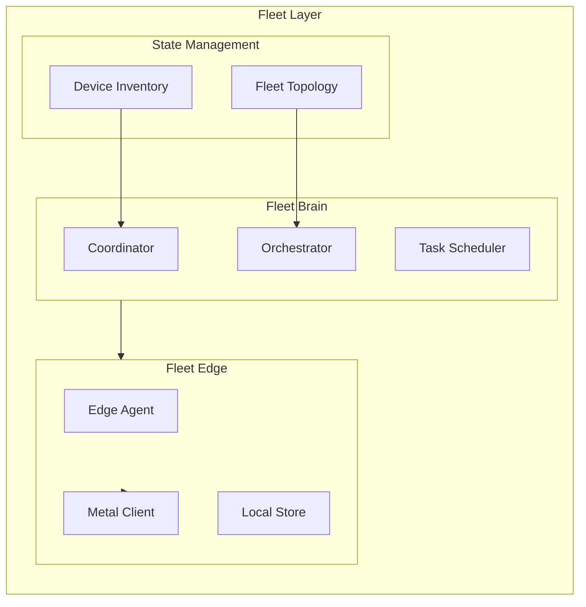
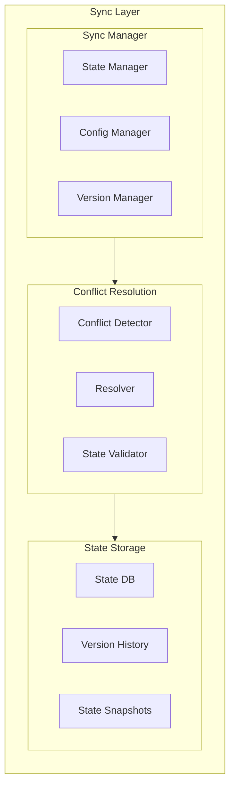
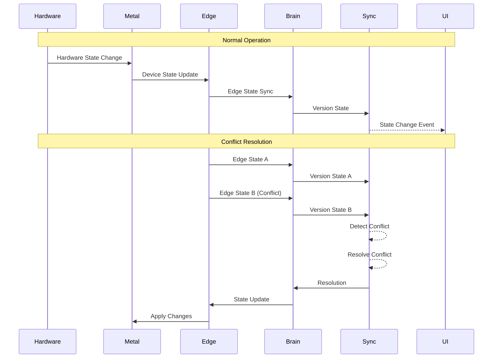
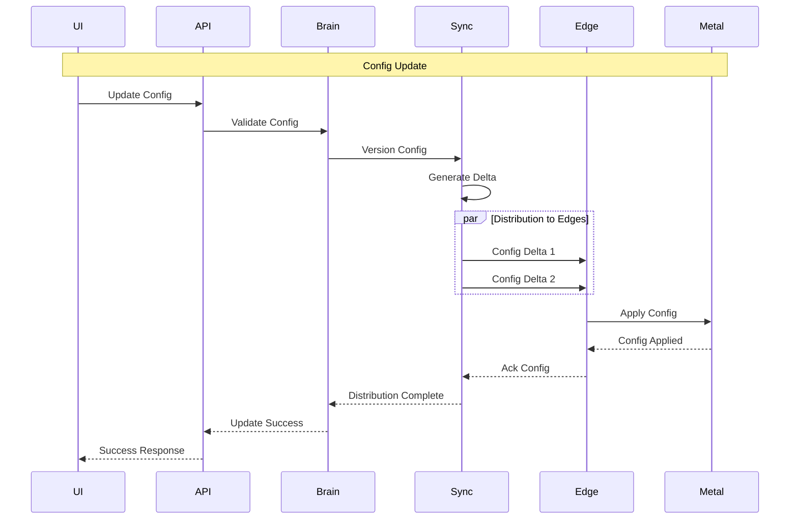
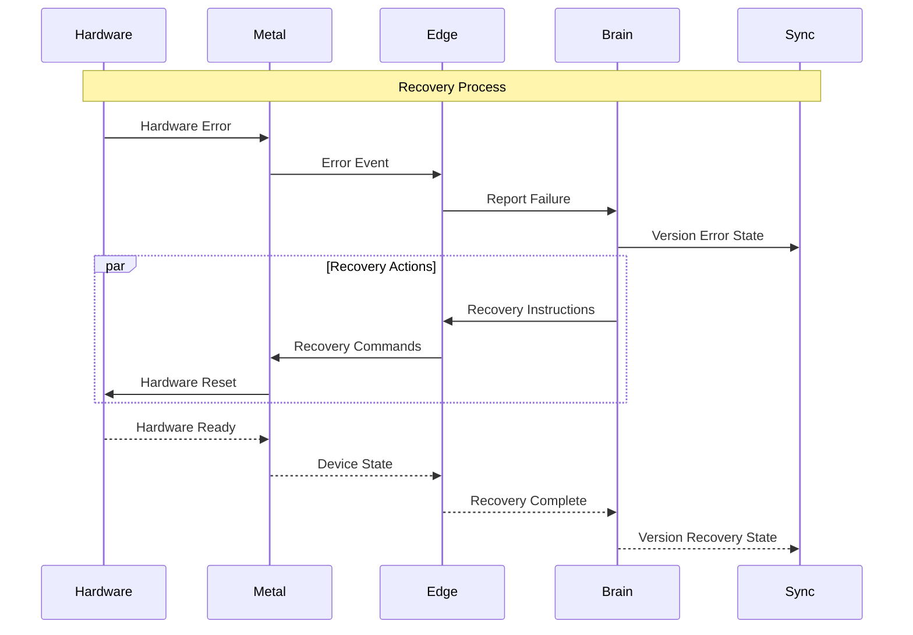
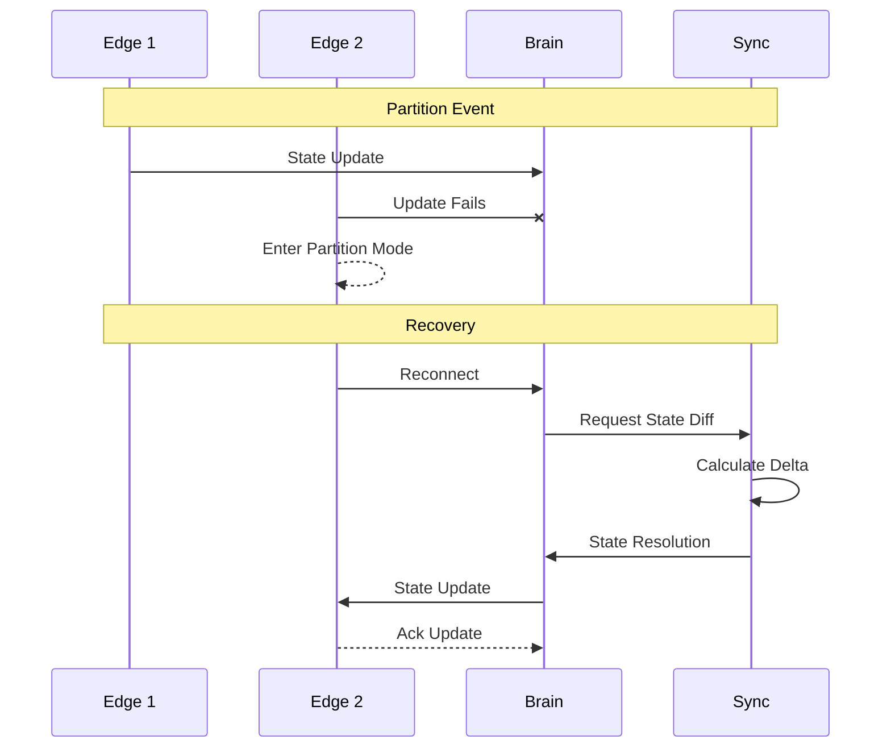
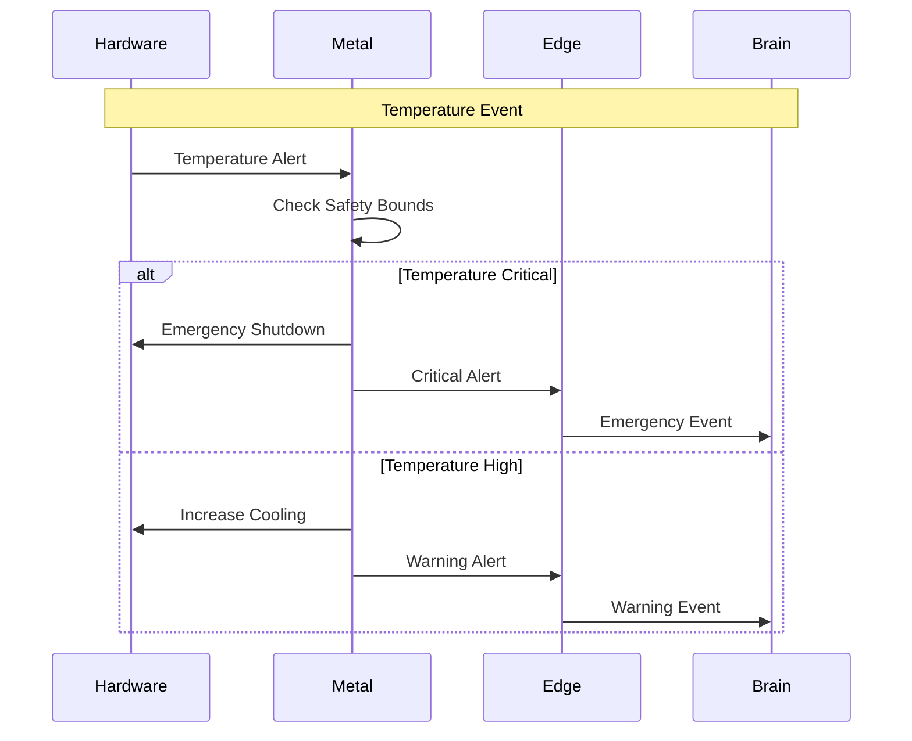
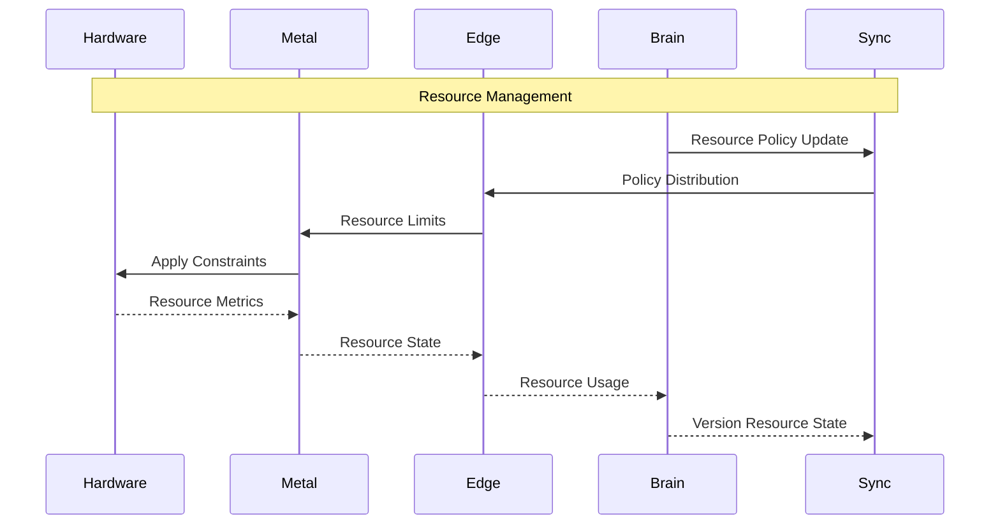

# Wrale Fleet Architecture Diagrams

This document contains key architectural diagrams visualizing system components and their interactions.

## System Overview

```mermaid
graph TB
    %% Top Level Architecture
    subgraph WraleFleet["Wrale Fleet System"]
        direction TB
        
        subgraph UserLayer["User Layer"]
            dashboard["Dashboard (Next.js)"]
            api["API (Go)"]
        end
        
        subgraph FleetLayer["Fleet Layer"]
            brain["Fleet Brain"]
            edge["Fleet Edge"]
        end
        
        subgraph SyncLayer["Sync Layer"]
            syncMgr["Sync Manager"]
            resolver["Conflict Resolver"]
            store["State Store"]
        end
        
        subgraph MetalLayer["Metal Layer"]
            metald["Metal Daemon"]
            hw["Hardware Control"]
            diag["Diagnostics"]
        end
    end

    %% Layer Connections
    dashboard --> api
    api --> brain
    brain --> edge
    brain --> syncMgr
    edge --> metald
    metald --> hw

    %% Cross-layer Data Flow
    hw --> diag
    diag --> brain
    syncMgr --> edge
    resolver --> store
    store --> brain
end
```

## Metal Layer Architecture



## Fleet Layer Architecture



## Sync Layer Architecture



## Critical Flow Diagrams

### State Synchronization Flow


### Configuration Distribution Flow


### Recovery Flow


### Network Partition Recovery


## Physical Safety Flows

### Temperature Safety Response


### Resource Management Flow
